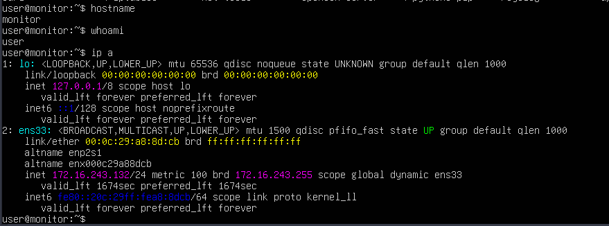
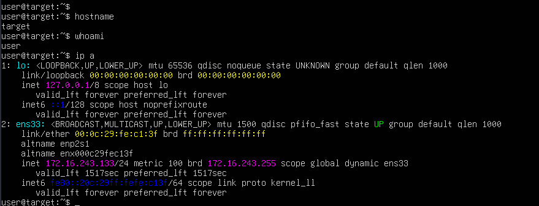
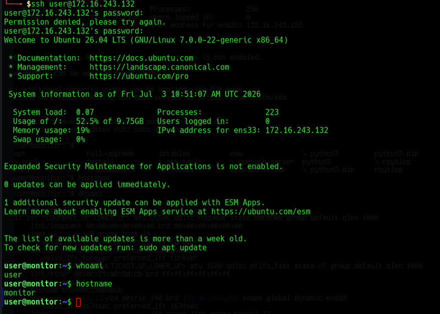
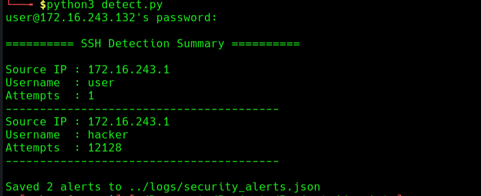
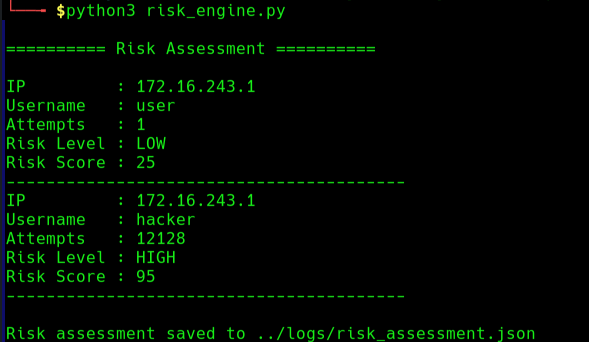
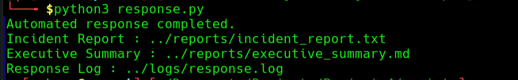
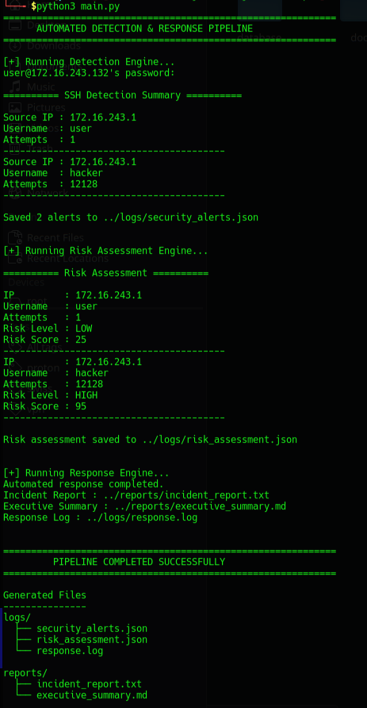

# Cyber Risk Monitoring & Automated Incident Response Platform

## Overview

This project demonstrates an automated security monitoring workflow that detects SSH brute-force attacks, evaluates their risk, and generates incident documentation within a controlled Linux lab environment.

The objective of this project was to:

- Configure centralized log collection using rsyslog.
- Simulate an SSH brute-force attack using Hydra.
- Detect failed SSH authentication attempts automatically.
- Assess the severity of detected events.
- Generate technical and management reports.
- Build an end-to-end detection and response workflow using Python.

---

## Technologies & Tools

- Parrot Security OS
- Ubuntu Server
- VMware Workstation
- Python 3
- Hydra
- OpenSSH
- rsyslog
- JSON
- Linux Terminal

---

## Lab Environment

### Attacker Machine

- Operating System: Parrot Security OS
- Role: Attack Simulation



---

### Monitoring Server

- Operating System: Ubuntu Server
- Role: Centralized Log Collection & Security Monitoring



---

### Target Server

- Operating System: Ubuntu Server
- Role: SSH Service



---

## Lab Architecture

```
                +------------------+
                |  Parrot OS       |
                |  Attacker        |
                +--------+---------+
                         |
                  Hydra SSH Attack
                         |
                         ▼
                +------------------+
                | Ubuntu Target    |
                | SSH Server       |
                +--------+---------+
                         |
                  Authentication Logs
                         |
                         ▼
                +------------------+
                | Ubuntu Monitor   |
                | rsyslog          |
                +--------+---------+
                         |
                    SSH Connection
                         |
                         ▼
                +------------------+
                | Python Pipeline  |
                +------------------+
```

---

## Methodology

The assessment followed the workflow below:

1. Configure centralized logging.
2. Verify communication between systems.
3. Simulate an SSH brute-force attack.
4. Collect authentication logs.
5. Detect suspicious authentication events.
6. Assess risk based on attack severity.
7. Generate incident documentation automatically.

---

# Detection Engine

The detection engine retrieves authentication logs from the monitoring server through SSH and identifies failed SSH login attempts.

For every event it extracts:

- Timestamp
- Source IP Address
- Username
- Number of failed login attempts

### Detection Output



---

# Risk Assessment Engine

Detected events are evaluated according to the number of failed authentication attempts.

| Attempts    | Risk Level |
| ----------- | ---------- |
| 1–3         | Low        |
| 4–7         | Medium     |
| More than 7 | High       |

### Risk Assessment



---

# Response Engine

The response engine converts technical findings into structured documentation.

Automatically generated outputs include:

- Incident Report
- Executive Summary
- Response Log

### Automated Response



---

# End-to-End Pipeline

The complete workflow can be executed using a single Python entry point.

```
Hydra Attack
      │
      ▼
Authentication Logs
      │
      ▼
Detection Engine
      │
      ▼
security_alerts.json
      │
      ▼
Risk Assessment
      │
      ▼
risk_assessment.json
      │
      ▼
Response Engine
      │
      ▼
Incident Report
Executive Summary
Response Log
```

### Pipeline Execution



---

## Project Deliverables

### Security Artifacts

- security_alerts.json
- risk_assessment.json
- response.log

### Management Reports

- incident_report.txt
- executive_summary.md

### Supporting Documentation

- Assessment Report
- Risk Register
- Executive Summary
- Control Mapping
- Lessons Learned

---

## Competencies Demonstrated

- Linux Administration
- Security Monitoring
- Centralized Logging
- SSH Security
- Python Automation
- Log Analysis
- Incident Detection
- Risk Assessment
- Security Documentation
- Technical Reporting
- Executive Reporting

---

## Lessons Learned

During this project I learned:

- How centralized logging improves security monitoring.
- How SSH authentication logs can be used to detect brute-force attacks.
- How to automate repetitive security tasks using Python.
- The importance of consistent data handling between multiple scripts.
- How technical findings can be translated into risk assessments and management reports.
- The value of documenting technical work in a structured and repeatable manner.

---

## Disclaimer

This project was developed and tested in a controlled virtual lab environment for educational purposes. All attacks were performed only against systems owned and configured for cybersecurity training. No unauthorized systems or third-party networks were targeted.
